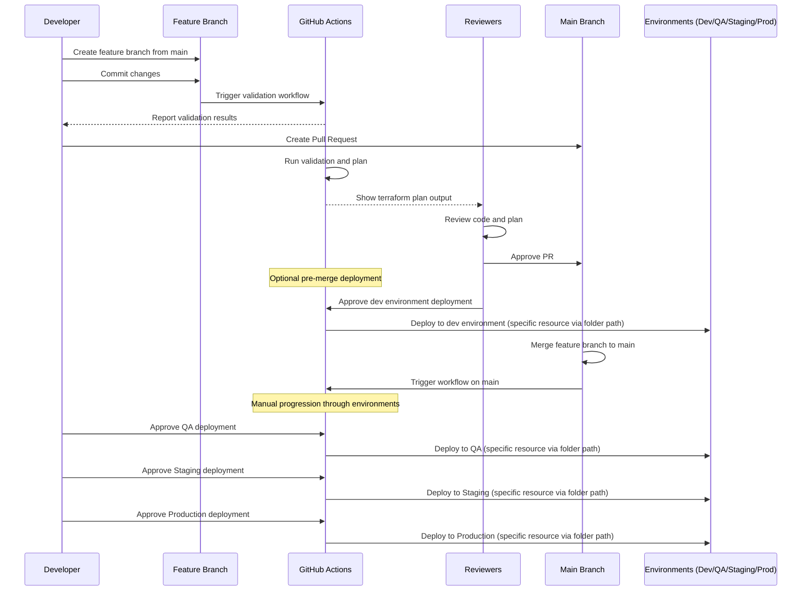

# Simplified Terraform Deployment Workflow

## Overview
This workflow uses a single main branch with feature branches for development. Deployments to higher environments are controlled through manual approvals in the pipeline rather than complex branching strategies. **All infrastructure is deployed in Google Cloud Platform (GCP)** and the CI/CD process is implemented using GitHub Actions.

## Project Structure

```
Project Structure
├── modules
│   ├── 00others
│   ├── 01net
│   ├── 02security
│   ├── 03dbs
│   └── 04compute
└── envs
    ├── 01dev
    │   ├── 00resources
    │   │   └── env.auto.tfvars
    │   ├── 01networking
    │   │   └── env.auto.tfvars
    │   ├── 02security
    │   │   └── env.auto.tfvars
    │   ├── 03databases
    │   │   └── env.auto.tfvars
    │   └── 04compute
    │       └── env.auto.tfvars
    ├── 02qa
    │   └── (similar folder structure as dev)
    ├── 03stage
    │   └── (similar folder structure as dev)
    └── 04prod
        └── (similar folder structure as dev)
```

In each environment folder (e.g., **01dev, 02qa, 03stage, 04prod**), resource configurations are separated into categories (e.g., **00resources, 01networking, 02security, 03databases, 04compute**). The environment-specific variable file (`env.auto.tfvars`) for each resource type is located within its respective folder. A dedicated pipeline is used to deploy each resource type per environment.

## Workflow Stages

### 1. Feature Development
- Developer creates a feature branch from main: `git checkout -b feat/new-feature main`
- Developer makes infrastructure changes on the feature branch
- On every commit, CI automatically runs:
  - **Job 1:** `terraform init`, `terraform fmt`, tfsec scan
  - **Job 2:** `terraform validate`, `terraform plan`
- These checks ensure code quality before the PR stage

### 2. Pull Request & Review
- Developer opens a pull request to merge the feature branch to main
- CI runs the same checks as in the feature development stage
- Reviewers evaluate the code and the terraform plan output
- After approval, an option becomes available to deploy to the dev environment directly from the feature branch
- This pre-merge deployment to dev is optional and helps verify changes work as expected

### 3. Main Branch & Environment Promotions
- Once the PR is merged to main, deployment pipelines for all environments become available
- All environment deployments are manual triggers to ensure controlled progression:
  - **Deploy to QA:** Manual approval → `terraform apply`
  - **Deploy to Staging:** Manual approval → `terraform apply`
  - **Deploy to Production:** Manual approval → `terraform apply`
- Each environment uses the same code but different environment-specific variable files located in their dedicated folders

## CI/CD Implementation

Below is the simplified GitHub Actions workflow configuration updated to support the new folder structure, explicit directory navigation, and race condition prevention using concurrency constraints. This configuration is tailored for GCP deployments.

```yaml
name: Terraform CI/CD

on:
  push:
    branches: [ '**' ]
  pull_request:
    branches: [ main ]
  workflow_dispatch:
    inputs:
      environment:
        description: 'Environment to deploy to'
        required: true
        default: 'dev'
        type: choice
        options:
          - dev
          - qa
          - staging
          - prod
      resource_type:
        description: 'Resource type to deploy'
        required: true
        default: '00resources'
        type: choice
        options:
          - "00resources"
          - "01networking"
          - "02security"
          - "03databases"
          - "04compute"

jobs:
  validate:
    name: Validate
    runs-on: ubuntu-latest
    steps:
      - uses: actions/checkout@v3
      - uses: hashicorp/setup-terraform@v2
      - name: Terraform Init
        run: terraform init
      - name: Terraform Format
        run: terraform fmt -check
      - name: Security Scan
        uses: aquasecurity/tfsec-action@v1.0.0
      - name: Terraform Validate
        run: terraform validate

  plan:
    name: Plan
    needs: validate
    runs-on: ubuntu-latest
    steps:
      - uses: actions/checkout@v3
      - uses: hashicorp/setup-terraform@v2
      - name: Change Directory to Env Path
        run: |
          if [ "${{ github.event.inputs.environment }}" == "dev" ]; then
            cd envs/01dev/${{ github.event.inputs.resource_type }}
          elif [ "${{ github.event.inputs.environment }}" == "qa" ]; then
            cd envs/02qa/${{ github.event.inputs.resource_type }}
          elif [ "${{ github.event.inputs.environment }}" == "staging" ]; then
            cd envs/03stage/${{ github.event.inputs.resource_type }}
          elif [ "${{ github.event.inputs.environment }}" == "prod" ]; then
            cd envs/04prod/${{ github.event.inputs.resource_type }}
          fi
          terraform init
      - name: Terraform Plan
        run: terraform plan -out=tfplan
      - name: Upload Plan
        uses: actions/upload-artifact@v3
        with:
          name: tfplan
          path: tfplan

  deploy:
    name: Deploy to ${{ github.event.inputs.environment }} - Resource: ${{ github.event.inputs.resource_type }}
    needs: plan
    runs-on: ubuntu-latest
    concurrency:
      group: ${{ github.workflow }}-${{ github.event.inputs.environment }}-${{ github.event.inputs.resource_type }}
      cancel-in-progress: false
    if: |
      (github.event_name == 'workflow_dispatch') ||
      (github.event_name == 'pull_request' && github.event.pull_request.state == 'open') ||
      github.ref == 'refs/heads/main'
    environment:
      name: ${{ github.event.inputs.environment }}
    steps:
      - uses: actions/checkout@v3
      - uses: hashicorp/setup-terraform@v2
      - name: Change Directory to Correct Env Folder
        run: |
          if [ "${{ github.event.inputs.environment }}" == "dev" ]; then
            cd envs/01dev/${{ github.event.inputs.resource_type }}
          elif [ "${{ github.event.inputs.environment }}" == "qa" ]; then
            cd envs/02qa/${{ github.event.inputs.resource_type }}
          elif [ "${{ github.event.inputs.environment }}" == "staging" ]; then
            cd envs/03stage/${{ github.event.inputs.resource_type }}
          elif [ "${{ github.event.inputs.environment }}" == "prod" ]; then
            cd envs/04prod/${{ github.event.inputs.resource_type }}
          fi
          terraform init
      - name: Terraform Apply
        run: |
          terraform apply -auto-approve -var-file=env.auto.tfvars
```

**Notes on the CI/CD Enhancements:**
- **Dedicated Pipelines per Resource Type:** The workflow_dispatch input `resource_type` allows triggering deployments for a specific resource category within an environment.
- **Explicit Directory Navigation:** Each job explicitly changes directory (`cd`) into the correct environment and resource type folder before executing Terraform commands.
- **Race Condition Prevention:** The use of the `concurrency` key ensures that no two jobs for the same environment and resource type run concurrently, preventing backend state race conditions.

## Workflow Sequence Diagram



## Advantages of This Approach

1. **Simplicity:** Single main branch reduces complexity and fragmentation.
2. **Cost Efficiency:** No longer creating and destroying test resources for every feature branch.
3. **Clear Promotion Path:** Changes flow linearly from dev → qa → staging → prod.
4. **Controlled Deployments:** Manual approvals for environment promotions.
5. **Reduced Maintenance:** Single pipeline handles all environments.
6. **Better Visibility:** Complete history of all changes in one branch.
7. **Easier Onboarding:** Simpler workflow for new team members to understand.
8. **Granular Deployments:** Dedicated pipelines per resource type with explicit directory navigation and concurrency control reduce the risk of race conditions when accessing the Terraform backend.

## Security Considerations

1. **Branch Protection:** Main branch is protected and requires approved PRs before merging.
2. **Role-Based Access Control:** Different roles for different environment deployments.
3. **Secrets Management:** Environment-specific secrets are stored securely in GitHub Secrets.
4. **Audit Trail:** All deployments and approvals are logged and traceable.
5. **Concurrency Constraints:** The GitHub Actions configuration uses concurrency groups to prevent race conditions for the same environment and resource type, ensuring backend state is accessed by only one job at a time.

## Best Practices for Implementation

1. **Infrastructure as Code Quality Checks:** Use pre-commit hooks and linters for consistent code style.
2. **Comprehensive Testing:** Include automated tests in the pipeline before deployments.
3. **Drift Detection:** Regular checks to detect manual changes to infrastructure.
4. **Documentation:** Keep documentation updated with workflow changes.
5. **Training:** Ensure all team members understand the workflow and their responsibilities.
6. **GCP Integration:** Leverage GCP best practices for resource management and security within the GitHub Actions workflows.

This approach provides the same governance benefits as the more complex strategy but with significantly less overhead and potential for errors, while ensuring controlled and concurrent-safe deployments across multiple resource types and environments.
