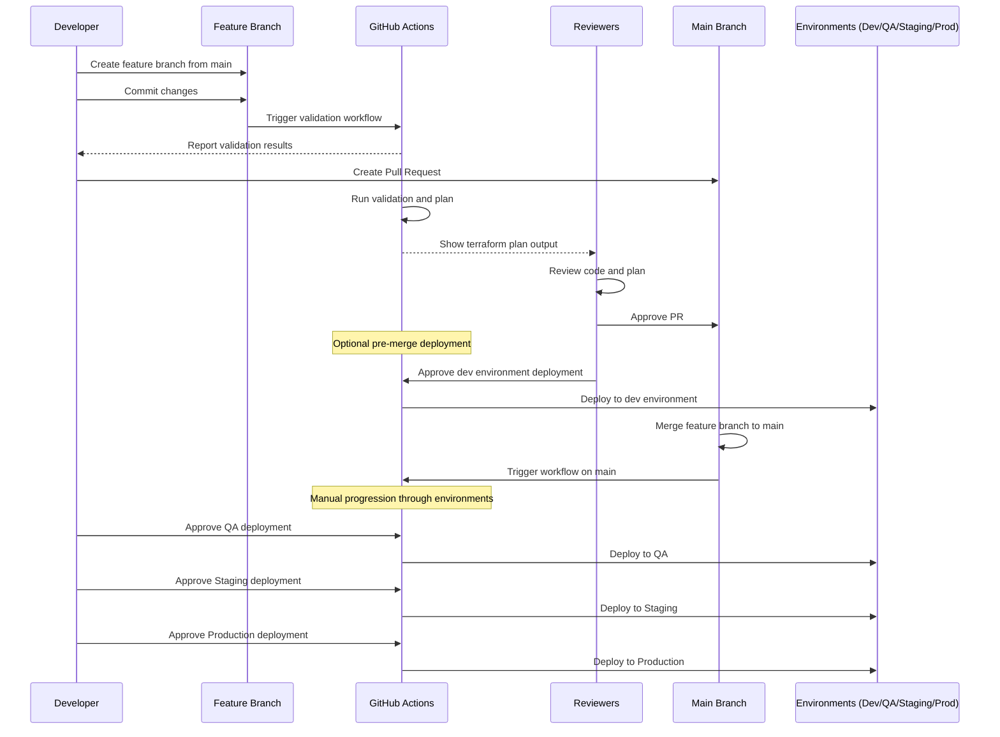

# Simplified Terraform Deployment Workflow

## Overview
This workflow uses a single main branch with feature branches for development. Deployments to higher environments are controlled through manual approvals in the pipeline rather than complex branching strategies.

## Workflow Stages

### 1. Feature Development
- Developer creates a feature branch from main: `git checkout -b feat/new-feature main`
- Developer makes infrastructure changes on the feature branch
- On every commit, CI automatically runs:
  - Job 1: `terraform init`, `terraform fmt`, `tfsec scan`
  - Job 2: `terraform validate`, `terraform plan`
- These checks ensure code quality before the PR stage

### 2. Pull Request & Review
- Developer opens a pull request to merge the feature branch to main
- CI runs the same checks as in the feature development stage
- Reviewers evaluate the code and the terraform plan output
- After approval, an option becomes available to deploy to the dev environment directly from the feature branch
- This pre-merge deployment to dev is optional and helps verify changes work as expected

### 3. Main Branch & Environment Promotions
- Once the PR is merged to main, deployment pipelines for all environments become available
- All environment deployments are manual triggers to ensure controlled progression:
  - Deploy to QA: Manual approval → `terraform apply`
  - Deploy to Staging: Manual approval → `terraform apply`
  - Deploy to Production: Manual approval → `terraform apply`
- Each environment uses the same code but different environment-specific variable files

## CI/CD Implementation

```
# Example simplified GitHub Actions workflow configuration
name: Terraform CI/CD

on:
  push:
    branches: [ '**' ]
  pull_request:
    branches: [ main ]
  workflow_dispatch:
    inputs:
      environment:
        description: 'Environment to deploy to'
        required: true
        default: 'dev'
        type: choice
        options:
        - dev
        - qa
        - staging
        - prod

jobs:
  validate:
    name: Validate
    runs-on: ubuntu-latest
    steps:
      - uses: actions/checkout@v3
      - uses: hashicorp/setup-terraform@v2
      - name: Terraform Init
        run: terraform init
      - name: Terraform Format
        run: terraform fmt -check
      - name: Security Scan
        uses: aquasecurity/tfsec-action@v1.0.0
      - name: Terraform Validate
        run: terraform validate

  plan:
    name: Plan
    needs: validate
    runs-on: ubuntu-latest
    steps:
      - uses: actions/checkout@v3
      - uses: hashicorp/setup-terraform@v2
      - name: Terraform Init
        run: terraform init
      - name: Terraform Plan
        run: terraform plan -out=tfplan
      - name: Upload Plan
        uses: actions/upload-artifact@v3
        with:
          name: tfplan
          path: tfplan

  deploy-dev:
    name: Deploy to Dev
    needs: plan
    runs-on: ubuntu-latest
    if: |
      (github.event_name == 'pull_request' && github.event.pull_request.state == 'open') ||
      (github.event_name == 'workflow_dispatch' && github.event.inputs.environment == 'dev') ||
      github.ref == 'refs/heads/main'
    environment:
      name: dev
    steps:
      - uses: actions/checkout@v3
      - uses: hashicorp/setup-terraform@v2
      - name: Terraform Init
        run: terraform init
      - name: Terraform Apply
        run: terraform apply -auto-approve -var-file=environments/dev.tfvars

  deploy-qa:
    name: Deploy to QA
    needs: deploy-dev
    runs-on: ubuntu-latest
    if: |
      (github.event_name == 'workflow_dispatch' && github.event.inputs.environment == 'qa') ||
      github.ref == 'refs/heads/main'
    environment:
      name: qa
    steps:
      - uses: actions/checkout@v3
      - uses: hashicorp/setup-terraform@v2
      - name: Terraform Init
        run: terraform init
      - name: Terraform Apply
        run: terraform apply -auto-approve -var-file=environments/qa.tfvars

  deploy-staging:
    name: Deploy to Staging
    needs: deploy-qa
    runs-on: ubuntu-latest
    if: |
      (github.event_name == 'workflow_dispatch' && github.event.inputs.environment == 'staging') ||
      github.ref == 'refs/heads/main'
    environment:
      name: staging
    steps:
      - uses: actions/checkout@v3
      - uses: hashicorp/setup-terraform@v2
      - name: Terraform Init
        run: terraform init
      - name: Terraform Apply
        run: terraform apply -auto-approve -var-file=environments/staging.tfvars

  deploy-prod:
    name: Deploy to Production
    needs: deploy-staging
    runs-on: ubuntu-latest
    if: |
      (github.event_name == 'workflow_dispatch' && github.event.inputs.environment == 'prod') ||
      github.ref == 'refs/heads/main'
    environment:
      name: production
    steps:
      - uses: actions/checkout@v3
      - uses: hashicorp/setup-terraform@v2
      - name: Terraform Init
        run: terraform init
      - name: Terraform Apply
        run: terraform apply -auto-approve -var-file=environments/prod.tfvars
```

## Workflow Sequence Diagram



## Advantages of This Approach

1. **Simplicity**: Single main branch reduces complexity and fragmentation
2. **Cost Efficiency**: No longer creating and destroying test resources for every feature branch
3. **Clear Promotion Path**: Changes flow linearly from dev → qa → staging → prod
4. **Controlled Deployments**: Manual approvals for environment promotions
5. **Reduced Maintenance**: Single pipeline handles all environments
6. **Better Visibility**: Complete history of all changes in one branch
7. **Easier Onboarding**: Simpler workflow for new team members to understand

## Security Considerations

1. **Branch Protection**: Main branch is protected and requires approved PRs before merging
2. **Role-Based Access Control**: Different roles for different environment deployments
3. **Secrets Management**: Environment-specific secrets are stored securely in GitHub Secrets
4. **Audit Trail**: All deployments and approvals are logged and traceable

## Best Practices for Implementation

1. **Infrastructure as Code Quality Checks**: Use pre-commit hooks and linters for consistent code style
2. **Comprehensive Testing**: Include automated tests in the pipeline before deployments
3. **Drift Detection**: Regular checks to detect manual changes to infrastructure
4. **Documentation**: Keep documentation updated with workflow changes
5. **Training**: Ensure all team members understand the workflow and their responsibilities

This approach provides the same governance benefits as the more complex strategy but with significantly less overhead and potential for errors.
