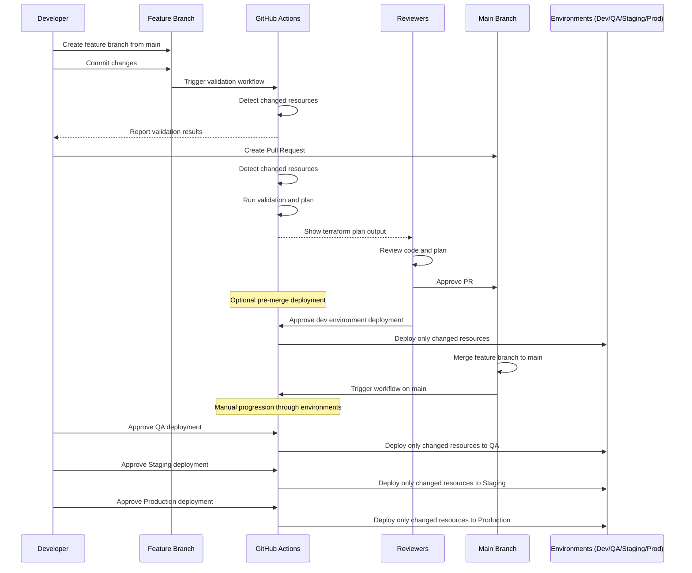

# Simplified Terraform Deployment Workflow

## Overview
This workflow uses a single main branch with feature branches for development. Deployments to higher environments are controlled through manual approvals in the pipeline rather than complex branching strategies. **All infrastructure is deployed in Google Cloud Platform (GCP)** and the CI/CD process is implemented using GitHub Actions.

## Project Structure

```
Project Structure
├── modules
│   ├── 00others
│   ├── 01net
│   ├── 02security
│   ├── 03dbs
│   └── 04compute
└── envs
    ├── 01dev
    │   ├── 00resources
    │   │   └── env.auto.tfvars
    │   ├── 01networking
    │   │   └── env.auto.tfvars
    │   ├── 02security
    │   │   └── env.auto.tfvars
    │   ├── 03databases
    │   │   └── env.auto.tfvars
    │   └── 04compute
    │       └── env.auto.tfvars
    ├── 02qa
    │   └── (similar folder structure as dev)
    ├── 03stage
    │   └── (similar folder structure as dev)
    └── 04prod
        └── (similar folder structure as dev)
```

In each environment folder (e.g., **01dev, 02qa, 03stage, 04prod**), resource configurations are separated into categories (e.g., **00resources, 01networking, 02security, 03databases, 04compute**). The environment-specific variable file (`env.auto.tfvars`) for each resource type is located within its respective folder. A dedicated pipeline is used to deploy each resource type per environment.

## Workflow Stages

### 1. Feature Development
- Developer creates a feature branch from main: `git checkout -b feat/new-feature main`
- Developer makes infrastructure changes on the feature branch
- On every commit, CI automatically runs:
  - Detects which specific resources were modified
  - **Validation:** `terraform init -backend=false`, `terraform fmt`, `terraform validate`
  - **Planning:** `terraform plan` (only for changed resources)
- These checks ensure code quality before the PR stage

### 2. Pull Request & Review
- Developer opens a pull request to merge the feature branch to main
- CI runs the same validation and planning checks (only for changed resources)
- Reviewers evaluate the code and the terraform plan output
- After approval, an option becomes available to deploy to the dev environment directly from the feature branch
- This pre-merge deployment to dev is optional and helps verify changes work as expected

### 3. Main Branch & Environment Promotions
- Once the PR is merged to main, deployment pipelines for all environments become available
- All environment deployments are manual triggers to ensure controlled progression:
  - **Deploy to QA:** Manual approval → `terraform apply` (only for changed resources)
  - **Deploy to Staging:** Manual approval → `terraform apply` (only for changed resources)
  - **Deploy to Production:** Manual approval → `terraform apply` (only for changed resources)
- Each environment uses the same code but different environment-specific variable files located in their dedicated folders

## CI/CD Implementation

The GitHub Actions workflow is configured to support change detection, granular deployments, explicit directory navigation, and race condition prevention. This implementation is tailored for GCP deployments with the following key components:

### Key Components

1. **Resource Change Detection**: 
   - A dedicated job identifies which specific resource folders have changed
   - Uses path filters to detect modifications in specific resource directories
   - For manual workflow triggers, supports selecting specific resource types or "all" resources

2. **Validation Process**:
   - Runs only for changed resources
   - Performs format checks, security scans, and validation
   - Uses isolated validation to prevent state file access during validation

3. **Planning Process**:
   - Creates matrix-based jobs for each changed resource
   - Generates and uploads plan files as artifacts
   - Uses proper directory navigation to work with the correct resources

4. **Deployment Process**:
   - Implements environment protection rules for controlled deployments
   - Uses concurrency constraints to prevent race conditions
   - Explicitly changes to the correct resource directories before applying changes
   - Applies resource-specific variable files

### Key Improvements

1. **Intelligent Resource Detection:** 
   - Only validates, plans, and deploys resources that actually changed
   - Supports deploying all resources when explicitly requested

2. **Matrix-based Deployment:**
   - Creates separate jobs for each changed resource type
   - Enables parallel execution while maintaining resource isolation

3. **Explicit Directory Navigation:**
   - Uses absolute paths for reliable directory changes
   - Properly navigates to resource-specific directories before running terraform commands

4. **Concurrency Control:**
   - Prevents race conditions when accessing Terraform state
   - Uses resource-specific concurrency groups to allow independent resources to deploy in parallel

## Workflow Sequence Diagram



## Advantages of This Approach

1. **Simplicity:** Single main branch reduces complexity and fragmentation.
2. **Cost Efficiency:** No longer creating and destroying test resources for every feature branch.
3. **Clear Promotion Path:** Changes flow linearly from dev → qa → staging → prod.
4. **Controlled Deployments:** Manual approvals for environment promotions.
5. **Reduced Maintenance:** Single pipeline handles all environments.
6. **Better Visibility:** Complete history of all changes in one branch.
7. **Easier Onboarding:** Simpler workflow for new team members to understand.
8. **Resource-Specific Deployments:** Only deploying changed resources minimizes deployment scope and risk.
9. **Parallel Processing:** Matrix-based jobs allow efficient parallel deployment of independent resources.
10. **Safer State Management:** Concurrency controls prevent Terraform state corruption from parallel jobs.

## Security Considerations

1. **Branch Protection:** Main branch is protected and requires approved PRs before merging.
2. **Role-Based Access Control:** Different roles for different environment deployments.
3. **Secrets Management:** Environment-specific secrets are stored securely in GitHub Secrets.
4. **Audit Trail:** All deployments and approvals are logged and traceable.
5. **Concurrency Constraints:** The workflow uses concurrency groups to prevent race conditions.
6. **Minimal Deployment Scope:** Only deploying resources that changed reduces the risk surface area.
7. **Authentication Security:** Using workload identity federation for GCP authentication instead of long-lived keys.

## Best Practices for Implementation

1. **Infrastructure as Code Quality Checks:** Use pre-commit hooks and linters for consistent code style.
2. **Comprehensive Testing:** Include automated tests in the pipeline before deployments.
3. **Drift Detection:** Regular checks to detect manual changes to infrastructure.
4. **Documentation:** Keep documentation updated with workflow changes.
5. **Training:** Ensure all team members understand the workflow and their responsibilities.
6. **GCP Integration:** Leverage GCP best practices for resource management and security within the GitHub Actions workflows.
7. **Resource Dependency Management:** Use Terraform dependencies to ensure resources deploy in the correct order.
8. **Output Management:** Capture and store outputs from deployments for debugging and monitoring.

This approach provides the same governance benefits as more complex strategies but with significantly less overhead and potential for errors. By only deploying resources that have actually changed, it minimizes risk and improves deployment efficiency.